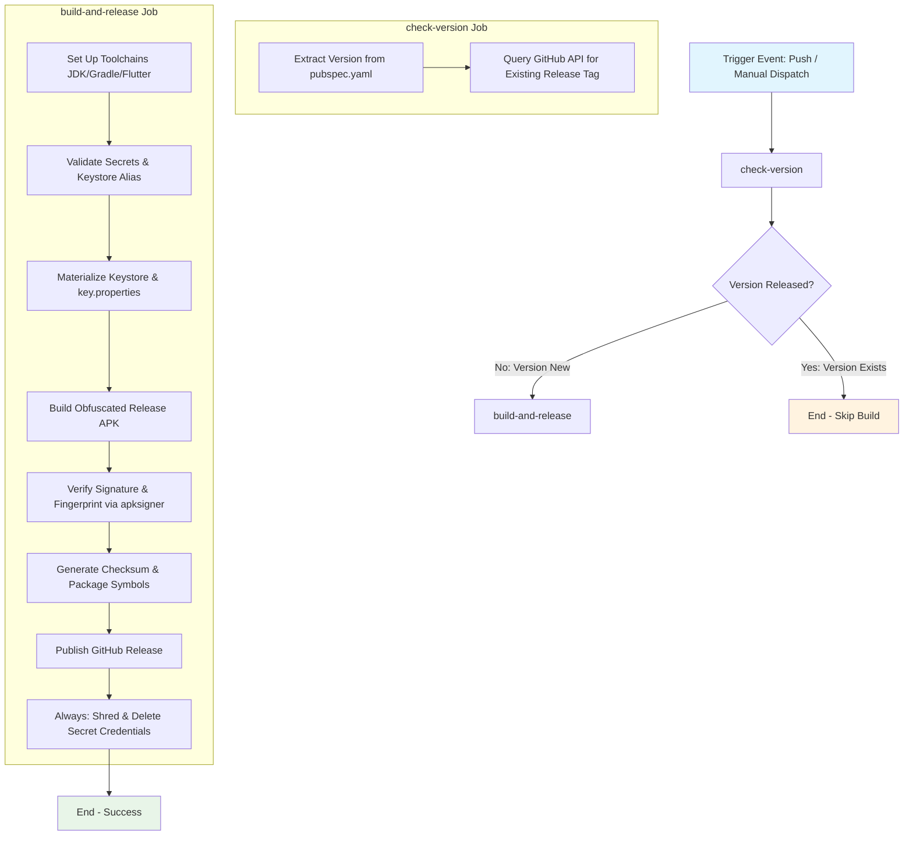

## Workflow Overview

**Purpose**: Build, sign, verify, and publish Android release APKs and debug symbols to GitHub Releases upon version updates.
**Trigger Events**: Pushes to `main` or `native` branches, or manual `workflow_dispatch` invocation.
**Target Environments**: Android Mobile Application Release Pipeline.

## Execution Flow Diagram



## Jobs & Dependencies

| Job Name | Purpose | Dependencies | Execution Context |
|----------|---------|--------------|-------------------|
| `check-version` | Extracts application version and checks if tag is already published | None | `ubuntu-latest` (read-only permissions) |
| `build-and-release` | Restores keystore, builds, signs, verifies, and uploads release artifacts | `check-version` (`should_release == 'true'`) | `ubuntu-latest` (contents write permissions) |

## Requirements Matrix

### Functional Requirements
| ID | Requirement | Priority | Acceptance Criteria |
|----|-------------|----------|-------------------|
| REQ-001 | Version Idempotency | High | Build skips automatically if tag `v<VERSION>` is already released |
| REQ-002 | Release Signing | Critical | Release APK is signed using keystore restored from secrets |
| REQ-003 | Signature Verification | Critical | `apksigner verify` confirms valid v1/v2 signature before release |
| REQ-004 | Fingerprint Matching | High | Signer SHA-256 matches `EXPECTED_CERT_SHA256` if secret is present |
| REQ-005 | Checksum Generation | Medium | `app-release.apk.sha256` file is generated and attached to release |
| REQ-006 | Symbol Archival | Medium | Obfuscation debug symbols zipped as `debug-info.zip` and attached |

### Security Requirements
| ID | Requirement | Implementation Constraint |
|----|-------------|---------------------------|
| SEC-001 | Keystore Secrecy | Base64 keystore and passwords stored strictly in GitHub Secrets |
| SEC-002 | Restricted File Access | `chmod 600` applied to `release.keystore` and `key.properties` |
| SEC-003 | Zero Secret Commits | Signing files excluded via root and Android `.gitignore` |
| SEC-004 | Secure Teardown | `always()` step shreds secret files (`shred -u` / `rm -f`) |
| SEC-005 | Secret Masking | Passwords passed strictly via environment variables, never echoed |

### Performance Requirements
| ID | Metric | Target | Measurement Method |
|----|-------|--------|-------------------|
| PERF-001 | Execution Time | < 25 minutes | Job timeout limit enforcement |
| PERF-002 | Toolchain Setup | Cached | Flutter action dependency caching enabled |

## Input/Output Contracts

### Inputs

```yaml
# Environment Secrets
ANDROID_KEYSTORE_BASE64: secret  # Purpose: Base64 encoded release keystore binary
KEYSTORE_PASSWORD: secret        # Purpose: Keystore access password
KEY_ALIAS: secret                # Purpose: Release key alias name
KEY_PASSWORD: secret             # Purpose: Key alias access password
EXPECTED_CERT_SHA256: secret     # Purpose: Optional expected signer certificate SHA-256 fingerprint

# Repository Triggers
branches: [main, native]
workflow_dispatch: null
```

### Outputs

```yaml
# Job Outputs
check-version.outputs.version: string  # Example: "1.0.0+1"
check-version.outputs.tag: string      # Example: "v1.0.0-1"
check-version.outputs.should_release: boolean # Example: "true"

# Release Artifacts
app-release.apk: file                 # Obfuscated release APK binary
app-release.apk.sha256: file          # SHA-256 checksum digest file
debug-info.zip: file                  # Obfuscated symbol map archive
```

### Secrets & Variables

| Type | Name | Purpose | Scope |
|------|------|---------|-------|
| Secret | `ANDROID_KEYSTORE_BASE64` | Encoded production keystore | Repository |
| Secret | `KEYSTORE_PASSWORD` | Production keystore password | Repository |
| Secret | `KEY_ALIAS` | Production release key alias | Repository |
| Secret | `KEY_PASSWORD` | Production key alias password | Repository |
| Secret | `EXPECTED_CERT_SHA256` | Optional fingerprint validation | Repository |
| Token | `GITHUB_TOKEN` | Release publication & API lookup | Workflow Job |

## Execution Constraints

### Runtime Constraints

- **Timeout**: 5 minutes for `check-version`, 25 minutes for `build-and-release`.
- **Concurrency**: Group `release-main`, `cancel-in-progress: false`.

### Environmental Constraints

- **Runner Requirements**: `ubuntu-latest` with JDK 17 (Temurin), Flutter 3.38.6 (stable), Gradle actions.
- **Network Access**: GitHub API access, Flutter pub dependencies, Maven Central / Google Maven.
- **Permissions**: `contents: read` for `check-version`, `contents: write` for `build-and-release`.

## Error Handling Strategy

| Error Type | Response | Recovery Action |
|------------|----------|-----------------|
| Missing Secrets | Immediate abort in `Validate signing secrets` | Admin must configure missing GitHub Secrets |
| Keystore/Alias Invalid | Abort in `Restore release keystore` step | Verify base64 keystore and password credentials |
| Gradle Build Error | Build abort | Fix compilation / Flutter build issues |
| Unsigned APK | Abort in `Verify signature` via `apksigner` | Ensure release signing config is correctly loaded |
| Fingerprint Mismatch | Abort in `Verify signature` step | Update `EXPECTED_CERT_SHA256` secret to match key |
| Cleanup Failure | Ignored due to `if: always()` | Fallback from `shred` to `rm -f` executes |

## Quality Gates

### Gate Definitions

| Gate | Criteria | Bypass Conditions |
|------|----------|-------------------|
| Version Gating | Release tag does not exist on GitHub Releases | None (Idempotent execution) |
| Keystore Integrity | `keytool -list` succeeds for alias and storepass | None |
| Signature Integrity | `apksigner verify --verbose --print-certs` returns 0 | None |
| Fingerprint Validation | SHA-256 digest matches `EXPECTED_CERT_SHA256` (if present) | Secret empty / omitted |

## Monitoring & Observability

### Key Metrics

- **Success Rate**: Target 100% on release tags.
- **Execution Time**: Average 5 to 10 minutes.

### Alerting

| Condition | Severity | Notification Target |
|-----------|----------|-------------------|
| Build Failure | High | GitHub Workflow Failure Notifications |
| Secret Missing | Critical | GitHub Actions Error Diagnostics Log |

## Compliance & Governance

### Audit Requirements

- **Execution Logs**: Retained according to GitHub Actions log retention policy.
- **Release Lineage**: SHA-256 digest attached directly to release notes.

### Security Controls

- **Access Control**: Secrets restricted to repository actions scope.
- **Credential Ephemerality**: Materialized key files destroyed unconditionally after every job run.

## Validation Criteria

### Workflow Validation

- **VLD-001**: `android/app/build.gradle` fails release builds if `key.properties` is missing.
- **VLD-002**: `apksigner verify` confirms valid v1 & v2 APK signing schemes.

## Change Management

### Update Process

1. **Specification Update**: Modify this document first (`/spec/spec-process-cicd-attendrix-ci.md`).
2. **Review & Approval**: Maintainer approval.
3. **Implementation**: Apply workflow updates to `.github/workflows/attendrix_ci.yml`.
4. **Testing**: Execute workflow via push or manual `workflow_dispatch`.

### Version History

| Version | Date | Changes | Author |
|---------|------|---------|--------|
| 1.0 | 2026-07-28 | Initial production release signing specification | Mobile DevOps |
| 1.1 | 2026-07-28 | Optimized secret restoration step, dynamic branch concurrency, and pub lock cache keying | Mobile DevOps |
